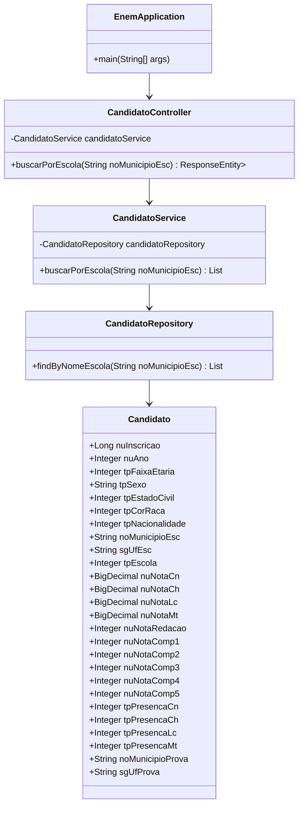

# Projeto: Análise de Dados do ENEM

Este projeto em Java foi desenvolvido para realizar análises de dados provenientes da tabela do ENEM. Ele utiliza Spring Boot para simplificar a criação de APIs REST e fornece ferramentas para manipulação, filtragem e visualização de dados.

## Funcionalidades

- Importação de dados do ENEM para o banco de dados.
- Filtros avançados por estado, cidade, escola, entre outros.
- Geração de relatórios estatísticos.
- Exposição de APIs REST para consulta de dados.

## Tecnologias Utilizadas

- **Linguagem**: Java 17
- **Framework**: Spring Boot
- **Banco de Dados**: PostgreSQL
- **Ferramenta de Build**: Maven
- **IDE**: IntelliJ IDEA

## Estrutura do Projeto

- **com.example.controller**: Contém os controladores responsáveis por expor as APIs REST.
- **com.example.model**: Define as classes que representam os dados do ENEM.
- **com.example.repository**: Interfaces para comunicação com o banco de dados.
- **com.example.service**: Contém a lógica de negócios.

```bash
src/
├── main/
│   ├── java/
│   │   └── com/
│   │       └── example/
│   │           ├── EnemApplication.java
│   │           ├── controller/
│   │           │   └── CandidatoController.java
│   │           ├── model/
│   │           │   └── Candidato.java
│   │           ├── repository/
│   │           │   └── CandidatoRepository.java
│   │           └── service/
│   │               └── CandidatoService.java
│   └── resources/
│       └── application.properties
```




## Pré-requisitos

Certifique-se de ter as seguintes ferramentas instaladas em sua máquina:

1. [Java 17+](https://www.oracle.com/java/technologies/javase-downloads.html)
2. [Maven](https://maven.apache.org/install.html)
3. [PostgreSQL](https://www.postgresql.org/download/)
4. [IntelliJ IDEA](https://www.jetbrains.com/idea/)

## Configuração do Ambiente

1. Clone este repositório:
   ```bash
   git clone https://github.com/usuario/analise-enem.git
   ```

2. Acesse o diretório do projeto:
   ```bash
   cd analise-enem
   ```

3. Configure o banco de dados PostgreSQL:
   - Crie um banco de dados chamado `enem_db`.
   - Atualize as credenciais no arquivo `application.properties`.

4. Compile o projeto:
   ```bash
   mvn clean install
   ```

5. Execute a aplicação:
   ```bash
   mvn spring-boot:run
   ```

## Endpoints Principais

- **GET /api/enem/dados**: Retorna todos os dados disponíveis.
- **GET /api/enem/estatisticas**: Gera relatórios estatísticos.
- **POST /api/enem/importar**: Importa novos dados para o banco.

## Contribuindo

Sinta-se à vontade para contribuir com este projeto! Abra uma issue ou envie um pull request com suas sugestões ou correções.

## Licença

Este projeto é distribuído sob a licença MIT. Consulte o arquivo LICENSE para mais detalhes.

## Contato

Dúvidas ou sugestões? Entre em contato pelo e-mail: [chrissperb@gmail.com](mailto:chrissperb@gmail.com).
